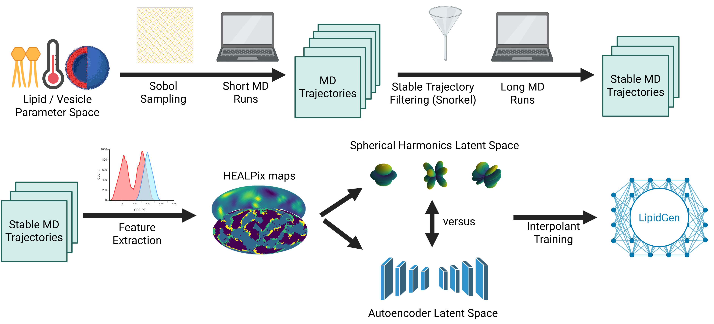

# LipidGen

**LipidGen** is a modular pipeline for studying the dynamics and organization of lipid vesicles using coarse-grained molecular dynamics (MD) simulations and generative modeling. The project builds on coarse-grained LAMMPS simulations and systematically extracts physically meaningful features — particularly spherical harmonic (SH) representations — which are then modeled using deep generative methods to capture the underlying stochastic dynamics.

This repository corresponds to the codebase developed during the MSc thesis:  
**"LipidGen: A Framework for Generative Modelling of Lipid Vesicles"** by Tim Wehnes (Delft University of Technology, 2025).

---

## 📁 Folder Overview



The numbered folders indicate the **chronological and logical order** in which they were used throughout the project:

- **0_lammps_simulations/** → Pipeline to quickly generate thousands of LAMMPS vesicle simulations based on specified vesicle/lipid/enviornmental parameters. Also includes weak supervision framework Snorkel to select    stable trajectories for longer production runs.

- **1_feature_extraction/** → Scripts to extract features describing individual simulation frames (morphological and phase separation).

- **2_latent_autoencoder/** → Autoencoder training (DeepSphere building blocks) and evaluation.

- **3_latent_sphericalharmonics/** → Spherical harmonics scripts covering optimal choice of max degree l, application to simulation data, and performance comparison to autoencoder in reconstruction accuracy.

- **4_interpolant/** → Pipeline for for training two-sided stochastic interpolant (using Diffusion Transformer architecture) and autoregressive sampling to create MD trajectories in seconds/minutes. Analysis scripts included.

Each folder contains its own `environment.yml` file to ensure isolated and reproducible environments tailored to the respective task.

---

## 🛠️ Getting Started

1. Clone the repository:
   ```bash
   git clone https://github.com/Tim-DIVO/LipidGen.git
   cd LipidGen
   ```

2. Choose the module you want to work with, navigate into it, and create the Conda environment:

    ```bash
    cd 1_feature_extraction
    conda env create -f environment.yml
    conda activate lipidgen_features  # or whatever name is listed inside
    ```

    
## 📄 Further details
For a full explanation of the methodology, feature choices, and modeling approach, see the accompanying thesis:
“LipidGen: A Framework for Generative Modelling of Lipid Vesicles” — T. Wehnes, 2025
TU Delft MSc Thesis, Department of Bionanoscience.

## 📦 Data Access
The full simulation dataset is not included in this repository.
📩 For access to the data, please contact Prof. Timon Idema at t.idema@tudelft.nl.

## 🙋 Questions
For questions about the code, project structure, or implementation details:
Tim Wehnes
📧 wehnestim@gmail.com
